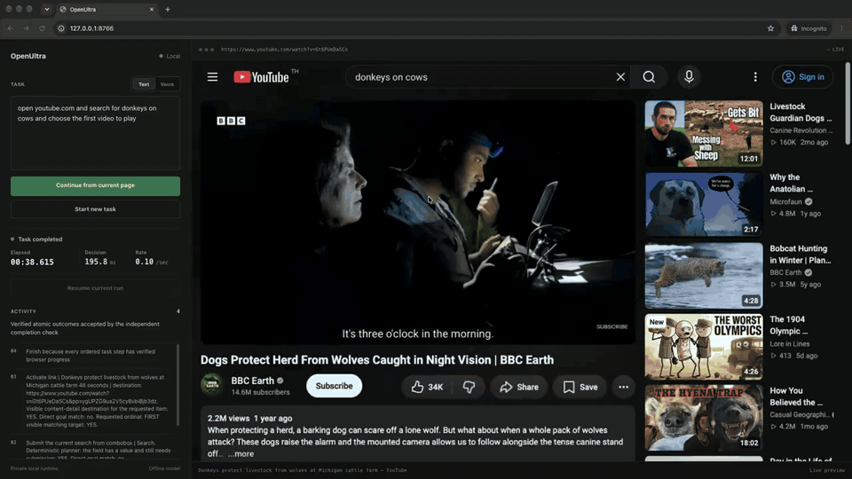

# OpenUltra

OpenUltra is an open-source browser agent that turns a text or spoken task into a sequence of observed, checked browser actions. Tell the browser what outcome you want, watch it work, and correct or continue it from the page it reached. Its default 421M-parameter Laya decision model runs locally on Apple Silicon: **no network calls for browser decisions and $0 hosted-model API cost**. Von 1.0 and an optional SemIf-style Qwen3.5 scorer can also run locally through MLX. The agent evaluates the next operation, compatible targets, and completion evidence without sending page content to a model service. Browser navigation still uses the network, and total task time depends on site behavior.

[](docs/demo.mp4)

[Watch the complete 71-second demo](docs/demo.mp4) | [How it works](#how-it-works) | [Current limits](#current-limits)

## Quick start

**Current platform:** an Apple Silicon Mac with macOS 14 or newer and [Homebrew](https://brew.sh/) for missing prerequisites. Allow several GB of free disk space for Python dependencies and the Laya checkpoint. Windows and Linux support is planned, but needs a non-MLX local inference backend; it is not available today.

Install Homebrew from its official site first if `brew --version` is unavailable. You do not need to install Chrome or Python separately when Homebrew is present: the setup script installs missing copies. It does not overwrite an existing supported Python or Chrome installation.

```bash
git clone https://github.com/aryan-confity/openultra-browser.git
cd openultra-browser
./scripts/setup_mac.sh
./scripts/start.sh
```

The setup script checks the platform, installs Google Chrome and Python 3.12 through Homebrew if missing, creates `.venv`, and installs the pinned runtime dependencies. It never runs a downloaded shell script or changes your personal Chrome profile. The start script opens a **dedicated Chrome profile** and starts the inspector at `http://127.0.0.1:8766`. Enter a task in the left rail and select **Start new task**. Use **Continue from current page** to revise the task without losing the browser page or its cookies. The first model load can take longer while the checkpoint is downloaded and cached.

If you already have a local Laya MLX checkpoint, set `OPENULTRA_MODEL_PATH=/absolute/path/to/model` before starting. Run `./scripts/start.sh --port 9876` to use another inspector port. No TypeSafe API key or remote text-model key is required.

### First run

1. Leave the terminal running after `./scripts/start.sh`; it hosts only the local inspector. The script prints the inspector address and opens it in your default browser.
2. In the inspector, enter a concrete task such as `Open example.com and follow the More information link`, then choose **Start new task**. The first task downloads the model checkpoint if it is not cached; later decisions use the local copy.
3. Watch the live browser view and activity log. **Continue from current page** starts a revised task on the page and browser profile already owned by the inspector. **Start new task** creates a fresh browser task.
4. Use **Pause** to stop the automatic decision loop, and `Ctrl+C` in the terminal to stop the inspector. The dedicated Chrome profile lives at `.runtime/chrome-profile` and is separate from your personal profile.

The displayed decision time measures local model inference, not page loading or end-to-end task completion. No hosted decision-model account, API key, or per-decision payment is needed. The browser still contacts the websites you ask it to visit.

### Decision models

Use **Decision model** above the task box to choose Laya or Von 1.0. Changing models loads the new checkpoint before replacing the active engine, keeps the current browser page and cookies, resets stale task decisions, and starts a new run identity. If loading fails, the previous engine stays selected. Pause an active run before switching.

| Model | Runtime | First selection | Notes |
| --- | --- | --- | --- |
| Laya (default) | MLX | Downloads the Laya checkpoint if absent | Smallest established OpenUltra path |
| Von 1.0 | MLX | Downloads a pinned ~1.6 GB checkpoint | Uses Von's default NLI classifier, not its separate option-marker backend |
| SemIf (optional) | MLX-LM | Downloads a pinned ~3.0 GB 4-bit Qwen3.5-4B checkpoint | Conditional option scores are **not calibrated confidence**; requires more memory and disk |

SemIf is disabled in the selector until its optional runtime is installed:

```bash
.venv/bin/python -m pip install -e '.[semif]'
./scripts/start.sh
```

Budget several additional gigabytes of free disk for model caches and use a Mac with enough memory for a 4B model; the optional path was exercised on a 24 GB Apple Silicon Mac. Checkpoint downloads need network access once, but inference then runs locally. Switching does not change the site's network requests or the browser's speech-recognition service. For CLI runs, pass `--model von-1.0-mlx` or `--model semif-mlx`; the default remains Laya.

When the optional MLX-LM extra is installed, **all three decision-model choices** can use the same pinned local Qwen3.5 checkpoint once per task to extract explicitly stated field values such as route, date, name, and phone. This follows the useful separation in [Laya Ultrafast](https://github.com/ipenywis/laya-ultrafast): text planning prepares values, while the typed model chooses among observed browser actions. OpenUltra keeps the text pass local instead of calling a hosted text model. Generated values are accepted only when present literally in your task; the planner cannot authorize a destination, a click, or completion. The checkpoint is shared with SemIf when SemIf is selected. Set `OPENULTRA_LOCAL_PLANNER=0` before starting to disable this optional pass and its additional memory use. Installing the extra does not make every site or task supported.

### Troubleshooting

- **Inspector port occupied:** run `./scripts/start.sh --port 9876`. This changes the UI port, not the Chrome DevTools port.
- **Chrome DevTools port occupied:** the launcher automatically selects another free port between 9333 and 9352 and verifies that an existing endpoint owns the expected isolated profile. To choose a specific port, set `OPENULTRA_BROWSER_CDP_PORT=9334` before `./scripts/start.sh`; an occupied explicit port fails instead of attaching to another profile. Set `OPENULTRA_BROWSER_CHROME_PROFILE` to another directory for an additional local instance.
- **Chrome or Python missing:** rerun `./scripts/setup_mac.sh` with Homebrew installed. The script uses Python 3.11-3.13 if present, otherwise installs Python 3.12.
- **First task or model switch appears slow:** allow the selected checkpoint download to finish and check free disk space. Repeated decisions do not redownload it. Set `OPENULTRA_MODEL_PATH` to an existing compatible Laya checkpoint to use a local copy.
- **Voice unavailable:** use Chrome or Edge for live speech recognition, or switch to Text. Chrome's speech service can require network access; typed tasks and Laya decisions do not.
- **A site needs sign-in or a control is missed:** complete sign-in yourself in the isolated browser, then continue from that page. Some iframes, shadow roots, canvas controls, and uploads are outside the current observer's supported scope.

### Text and voice

Text mode sends your task directly to the guarded browser loop. Voice mode uses the browser's speech-recognition API as an **input adapter to the same loop**. It can act early on a complete, reversible first command while you are still speaking; values, search queries, submissions, and other consequential actions wait for a final utterance. Recognition availability and audio processing depend on your browser and its speech service, so **local model inference does not imply that speech recognition is offline**. Use Chrome or Edge for live voice; text and transcript fallback remain available when recognition is unsupported.

## How it works

OpenUltra uses typed decisions rather than asking a language model to generate selectors or scripts. A typed decision asks a fixed question such as *which observed operation?*, *which visible target?*, or *is the goal complete?* and returns probabilities over declared options. This is the same interface pattern explored by TypeSafe's **Jev** work. **Laya** is the default trained decision model, executed through `laya-mlx`. **Von 1.0** scores entailment of each declared option with its ModernBERT classifier; OpenUltra ports its published checkpoint to MLX. The optional **SemIf** path reads Qwen3.5's next-token logits over declared letter slots rather than generating an answer. These are different scoring methods, not interchangeable probability calibrations. None writes arbitrary form text: OpenUltra binds only literal values supplied in the task or named prepared inputs.

```text
task + visible page
      -> optional one-time local extraction of literal field values
      -> one bounded DOM observation and indexed action space
      -> local typed-model batch(es): operation, compatible targets, completion, stuck
      -> deterministic safety and freshness checks
      -> one Chrome DevTools action and a new observation
      -> repeat or stop on verified outcome
```

The browser adapter performs one page observation per cycle and offers only actions grounded in visible controls. Batching compatible decision questions avoids a model call for each possible button; larger option sets may need several bounded batches. Browser work, page loading, speech recognition, and model loading still contribute to total task time; decision latency alone is not end-to-end speed. OpenUltra shows elapsed time, latest model decision time, and decisions per second in the inspector.

Model output is a **proposal, not permission or proof**. The executor rechecks the selected node before input, restricts destinations, blocks sensitive actions by default, and does not blindly retry an action that might already have executed. Completion requires observable page evidence; optional URL and visible-text postconditions provide stronger checks. The architecture and trust boundaries are described in [Architecture](docs/architecture.md).

## Command line

Start the dedicated Chrome profile, then use the CLI for bounded tasks with explicit postconditions:

```bash
export BU_CDP_URL="$(./scripts/launch_chrome.sh)"
.venv/bin/openultra-browser run https://example.com \
  --goal "Open the documentation" \
  --success-url-prefix https://example.com/docs \
  --trace artifacts/docs-run.json
```

For a form or search, pass user-provided values as named prepared inputs:

```bash
.venv/bin/openultra-browser run https://example.com/search \
  --goal "Search for local inference" \
  --input query="local inference" \
  --success-text "Search results"
```

The CLI starts with the initial domain allowlisted. Add a required destination with `--allow-domain`. Passwords and file inputs are not automated. Financial or destructive controls require explicit `--allow-risky`; review the site and result before enabling that option. The inspector permits task-led navigation across observed HTTP(S) links but retains the other guards. Both modes use an isolated browser profile, never your personal Chrome profile.

## Current limits

- This is an **alpha** browser agent, not a claim of reliable completion for arbitrary sites or tasks. The models are not browser-specialized, and probabilities are not guarantees of correctness. SemIf's raw option probabilities have not been calibrated for OpenUltra's browser workflow.
- It observes DOM controls and visible text, not visual-only canvas interfaces. Shadow DOM, frames, uploads, downloads, and nested scrolling are not supported yet.
- It does not invent missing form values or write open-ended text. Supply exact values in the task or through `--input`.
- Complex goals work best as small, observable outcomes. Give a URL or visible-text postcondition for consequential workflows and check the final page yourself.
- The inspector binds to loopback, but the browser visits real sites. Voice recognition may use a browser-provided online service. Do not put secrets in public issue reports or traces.

## Develop and contribute

```bash
.venv/bin/python -m pip install -e '.[dev]'
npm ci
.venv/bin/ruff check .
.venv/bin/pytest -q --cov=openultra_browser --cov-report=xml:coverage.xml --cov-fail-under=80
npm test
.venv/bin/python -m build
```

The npm package exists only for inspector JavaScript tests; it is not a runtime dependency. CI runs both language test suites, lint, coverage checks, and a package build. `sonar-project.properties` imports `coverage.xml` and `coverage/lcov.info` for a local SonarQube scan. See [Contributing](CONTRIBUTING.md) for PR expectations, [Security](SECURITY.md) for private vulnerability reports, and [Code of Conduct](CODE_OF_CONDUCT.md) for community standards.

## Credits and license

OpenUltra is licensed under [Apache 2.0](LICENSE), which permits commercial and private use and includes an explicit patent grant. Preserve the license and applicable notices when redistributing. Dependency and adapted-code notices are in [THIRD_PARTY_NOTICES](THIRD_PARTY_NOTICES) and [NOTICE](NOTICE).

The decision-model explanation draws on [TypeSafe's Jev introduction](https://typesafe.ai/blog/introducing-system-one-models-and-jev), [Laya](https://github.com/NandhaKishorM/laya), [Laya MLX](https://github.com/mizorewww/laya-mlx), [Von](https://github.com/wfzyx/von), and [SemIf](https://github.com/TheoLeeCJ/SemIf). Browser-agent implementation references include [Jev Ultrafast](https://github.com/browser-use/jev-ultrafast), [Jev Browser](https://github.com/Ying-Kai-Liao/jev-browser), [Jev Voice Browser](https://github.com/moritzkremb/jev-voice-browser), and [Laya Ultrafast](https://github.com/ipenywis/laya-ultrafast). OpenUltra is independent of these projects and does not use Jev or a TypeSafe service at runtime.
